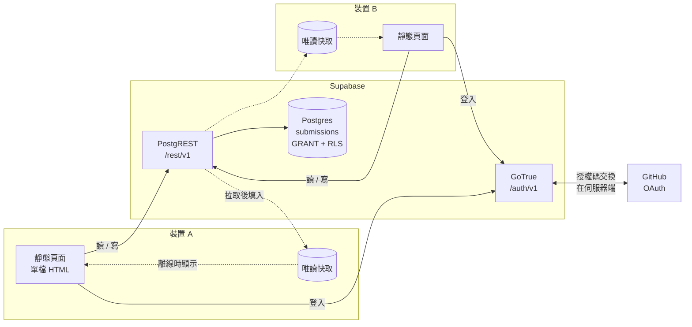
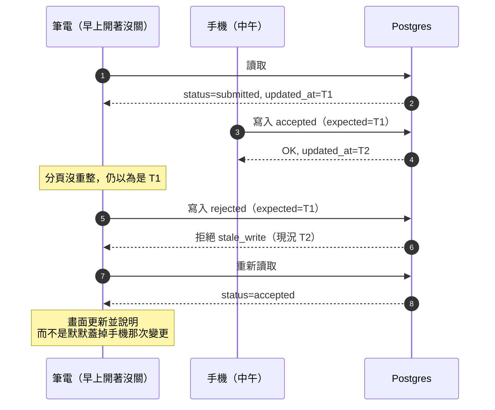

# FM/PL/AI 會議截稿行事曆

追蹤形式方法、程式語言與人工智慧領域會議的截稿日與後續里程碑，資料以 YAML 保存、
由分層抓取自動維護，輸出成一頁靜態網站與可訂閱的 `.ics`。

以 2027 年為起點建立，但**不釘在任何一年**：來源公布新年度就自動抓進來，還沒公布
就自動往前推估（見「推估會自動往前滾」）。

```
npm install
npm run build          # -> dist/index.html，直接雙擊即可開啟（不必起 server）
npm run validate       # schema + 合理性檢查
npm run refresh        # 抓取所有來源並寫回 YAML（--dry-run 只印不寫）
npm run add CONCUR     # 只給縮寫，自動補齊整份資料
npm run ranks FSE      # 查 ICORE 排名
npm run resolve ...    # 把 issue 對話裡選的答案套用到某個會議
npm run audit          # 檢查推估值：快到期了還沒確認？基準是不是太舊？
npm run ack            # 列出待確認的自動抓取結果；確認過的不再提示
npm test               # 用真的 DOM 對 dist/index.html 跑瀏覽器層測試
npm run lint:docs      # 驗證 README 裡的 mermaid 圖能解析
```

## 兩層資料模型

**會議層**（`data/conferences/*.yml`，進版控）記錄 CFP 公布的事實。
**個人層**（你的帳號底下，或未設定同步時放在瀏覽器裡）記錄你自己投了什麼、進行到哪一步。

分開的理由很實際：repo 是公開的，而「哪篇論文正在哪裡審、哪一篇被拒過」不該留在
公開的 git 歷史裡。這一層從來不進版控。

標題可以就地改（`改標題`）——投出去之前標題本來就還會動，而改名不該連帶影響狀態與歷程。
另有 JSON 匯出／匯入與「下載我的 .ics」。

個人層真正的作用是**依狀態浮現里程碑**：標成 `submitted` 之後，該會議的
notification 才會浮上來；標成 `accepted` 之後才輪到 camera-ready 與註冊。
這些日期本來就在會議資料裡，狀態只決定哪些對你有意義。

這層資訊也會標回「截稿時間軸」，兩個層次：

- **底色** ＝ 這場會議有你追蹤的論文，該屆所有里程碑都標上（看得到整段流程）
- **反白** ＝ 那篇論文的**下一個**關鍵日期，每篇最多一個（知道現在該看哪裡）

反白取的是 `pending()` 的第一筆，也就是「我的投稿」列最上面那一筆，所以兩個檢視
不可能對不上。

急迫度走左側色條、歸屬走背景色，兩個獨立通道疊加而不互相蓋掉。沒有投稿紀錄時
時間軸完全不變，不會多出任何雜訊。

### 跨裝置同步

沒有 `data/sync-config.json` 時同步關閉，個人層就只存在瀏覽器 localStorage。設定之後
改走 Supabase + GitHub 登入，做法見 `supabase/SETUP.md`。



**圖裡最重要的是不存在的那條線:快取沒有回寫箭頭。** 快取由伺服器的回應填入、離線時
供顯示，永遠不是寫入資料庫的來源。兩台裝置因此不可能各自前進——沒有合併邏輯，也沒有
衝突解決，那是 local-first 才需要背的複雜度。

離線時控制項全部停用。**不能離線編輯正是分歧無法產生的機制**，不是使用上的不便。

#### 登入為什麼不需要 secret

授權碼換 token 需要 client secret，而靜態頁藏不住 secret。GoTrue 把那一步放在**它自己的
伺服器**上：頁面只是導向 `/auth/v1/authorize`，回來時 token 已經在 URL fragment 裡
（隨即被 `history.replaceState` 清掉，fragment 會留在瀏覽紀錄裡）。

這正是選 Supabase 而不是 Firebase 的決定性理由——Firebase 要嘛內嵌 SDK，要嘛自己跑完
GitHub OAuth 流程（於是又需要一個後端）。

#### 唯一剩下的風險:過期分頁

同一個人、兩台裝置，仍有一種順序會出事——早上開著的分頁，寫入時帶的是早上讀到的狀態。



`save_submission` 收下前端讀到的 `updated_at` 當 compare-and-set token，不符就丟
`stale_write`。這是**一個欄位**的成本，不是一套合併演算法——因為要處理的是「寫入時的
前提已經過期」，不是「兩份分歧的資料要合流」。

#### 安全性:兩層,缺一不可

網頁裡的 publishable key 本來就設計成公開，真正的防線是資料庫這兩層：

| 層 | 管什麼 | 這裡的設定 |
|---|---|---|
| **GRANT** | 角色能不能碰這張表 | 只給 `authenticated`；`anon` 什麼都沒有 |
| **RLS** | 能碰哪些列 | 四條 policy 全綁 `auth.uid()` |

兩層分開這件事很容易踩到:SQL Editor 建的表**不會**自動授權(只有 dashboard 建的才會)，
少了 GRANT 連登入的使用者都會拿到 `42501`，而錯誤訊息會讓人以為是 RLS 設錯。

#### 其他

沒有用 Supabase 的 SDK——那是約 150 KB 的 bundle 換四個 fetch，而這頁「單檔、不吃 CDN」
的性質更值錢（也是 artifact 預覽能在嚴格 CSP 下運作的原因）。`site/sync.js` 135 行，
零依賴，直接打 REST。

免費專案 7 天無活動會暫停，`refresh.yml` 每晚順手 ping 一次擋掉。

真實的 OAuth 往返沒辦法自動測，需要實際專案憑證；`test/sync.test.mjs` 用 stub 過的後端
涵蓋 session 處理、唯讀快取、離線拒寫、CAS、401 過期，以及登入導回時把 token 從網址列
清掉。

## 里程碑是開放詞彙

`kind` 不是 enum。常用值有 `abstract` / `submission` / `rebuttal_start` /
`rebuttal_end` / `notification` / `revision` / `final_notification` /
`camera_ready` / `artifact_submission` / `registration`，但你隨時可以加
`visa_letter_deadline` 之類的新種類，不必改任何程式。

只有 `chain: true` 的里程碑（主審稿流程）會被檢查先後順序。artifact 與
early-rejection 刻意不在鏈上——artifact 在有些會議是投稿時交、有些是錄取後才交，
硬性排序會編碼一個不成立的假設。

## 主題

**預設深色。** 深色色票直接放在 `:root` 上，不是藏在 `@media (prefers-color-scheme)`
後面——否則頁面會先畫成淺色再被 JS 換掉，開啟時會閃一下白。切換鈕把選擇存進
localStorage，之後沿用；按鈕上寫的是「切過去會變成什麼」，不是目前狀態。

## 時區

日期一律照 CFP 原文顯示（多為 AoE），因為你要拿它跟 CFP 對照；滑鼠移到日期上會顯示
換算成你當地時間是幾點。

**剩餘天數用的是你所在時區的日曆天差，不是「還有幾個 24 小時」。** 後者會在截稿瞬間
對應的當地鐘點跳動——VMCAI 的 AoE 截稿對台北使用者是每晚 7:59 減一天，沒有人會預期
這種行為。現在比較的是兩個當地午夜，所以數字在當地午夜更新，跨 DST 也不會多算少算。
最後一天改顯示剩餘小時，因為「今天」不足以區分還有兩小時還是二十小時。

`.ics` 匯出的是絕對 UTC 時刻，由行事曆軟體自行換算。

頁首固定列有一個 **AoE 液晶時鐘**，顯示 `MM-DD` 和 `HH:MM`，兩者同一尺寸。

截稿日寫的是 `2026-09-16 23:59:59 AoE`，所以你真正要確認的是「AoE 還是不是 16 號」——
日期才是關鍵的那一半，不是附註，因此和時間等大。秒數拿掉了，它從來不會改變答案；
冒號仍然每秒閃爍，那是沒有秒數時唯一還在動的東西。年份和星期留在小字標籤列。

數字是七段多邊形而不是等寬字型：讓 LCD 看起來像 LCD 的是**鬼影段**（未點亮的七段仍
隱約可見），少了它就只是綠框裡的數字。它刻意在深淺兩種主題下長得一樣——嵌在面板上的
儀器不會因為室內燈光改變而改變外觀。

## 四級信心

| 級別 | 意義 |
|---|---|
| `confirmed` | 官方 CFP 明載 |
| `announced` | 官網暫定，或來自社群來源 |
| `estimated` | 由前一屆 +364 天推算 |
| `unknown` | 欄位存在，日期尚未公布 |

推估用 **+364 天（52 週）而非 +1 年**，因為 CFP 截稿日固定在星期幾的程度遠高於
固定在日期。FMCAD 2026 abstract 是 5/4（週一），推估 2027 得到 5/3（仍是週一）。

## 推估會自動往前滾

**已公布的新年度會自動抓進來。** 年份過濾只擋舊資料（`year < 今年 - 1`），沒有上限，
所以來源一公布 2028 的 edition，隔天 cron 就會建立它，並照常套用下面所有護欄。

**還沒公布的年度會自動推估。** `refresh` 的 `rollForward` 在一個會議**已經沒有任何
未來的投稿截止日**時，用最近一屆有真實日期的版本往前推一年。會議通常只提前六到九個月
公布，那段空窗正是推估存在的理由；沒有這一步，行事曆會在起始年度的截稿日過完之後
停在原地不再往前看。

兩個性質讓它不會失控：

- **不會越滾越多年。** 觸發條件是「沒有任何未來投稿截止日」，一旦下一年的推估存在
  就不再觸發。連跑兩次是零變更。
- **會被真實資料取代。** CFP 一出現，`decide()` 就把 `estimated` 升級成 `confirmed`
  （信心高者優先），推估值連同 `derived_from` 一起被覆蓋。

`npm run audit`（`build` 每次也會跑）盯著推估值的三種老化：

| 條件 | 意思 |
|---|---|
| 推估日在 **90 天內**仍未確認 | 快到了卻沒查到官方 CFP，網頁上該筆標紅 |
| 推估日**已經過去**且從未確認 | CFP 可能改了，或我們從沒找到 |
| 基準屆**超過 2 年前** | 跨度太大，不該當成可信的日期 |

推估的誤差是有量級的：以 2024 年為基準推出的 TACAS 2027 截稿日差了 7 天，而 CPP 2027
的推估摘要日**比真實日期晚 6 天**。晚的那種特別危險——照著它規劃就是直接錯過。

## 抓取分層

| Tier | 來源 | 涵蓋 | 信心上限 |
|---|---|---|---|
| 0 | ICORE portal CSV | 排名，幾乎全部 | `confirmed` |
| 1 | `ccfddl/ccf-deadlines` | 主流會議，長尾差 | `announced` |
| 2 | `conf.researchr.org` | 僅 ACM SIGPLAN/SIGSOFT 家族，但里程碑最完整 | `confirmed` |
| 3 | WikiCFP | 長尾全中，社群填寫 | `announced` |
| 4 | 各會議官網 adapter | 視需要新增 | `confirmed` |

信心上限寫在 adapter 裡，不靠人記得：WikiCFP 抓到的東西**永遠不會**被寫成
`confirmed`。

## 自動寫入的護欄

`npm run refresh` 直接改 YAML，所以每一筆寫入都要先過關：

- **不覆蓋手填的官方日期。** `confidence: confirmed` 且沒有 `source_url` 的值是人
  從 CFP 讀來的；機器可以更新自己維護的日期，但不能推翻人的判讀。
- **同一 kind 有多個候選就一個都不寫。** ATVA 同時有 paper notification 與
  early-rejection notification；二選一等於擲骰子。
- **來源身分要對得上。** WikiCFP 以縮寫索引，而縮寫會跨領域衝突——它的 "SAS 2026"
  是 Society for Animation Studies，不是 Static Analysis Symposium。標題相似度低於
  0.4 一律丟棄。
- **合併後整個 edition 要重驗**（截稿日不得晚於會議開始、鏈上里程碑須依序、
  日期須落在合理年份區間）。不過就整批回退。
- **`locked: true`** 可釘住任何你確認過的值。
- 過不了的通通進 `data/_review_queue.json`，網站上會顯示。
- **看過的可以確認掉**（`npm run ack`）。這不是可有可無的：多數項目是穩定的事實而
  不是待辦決定——WikiCFP 上的 CADE 是別的會議，明天還是——所以無法關掉的警告會變成
  壁紙，然後真正新的那一筆就沒人讀了。確認不是刪除，紀錄仍在 `_acknowledged.json` 裡，
  細節有實質變動時會自己回來。
- 每次 refresh 都是一次 bot commit，`git diff` 逐行可讀，`git revert` 就是還原鍵。
- 部署透過 `workflow_run` 接在 refresh 之後，而不是靠 push 觸發：GitHub 規定用
  `GITHUB_TOKEN` 推的 commit **不會觸發任何 workflow**（防無限迴圈），所以 bot 更新
  資料之後網站不會自己重建。refresh 失敗時不部署。

## 瀏覽器層測試

`npm test` 用 jsdom 對**建好的** `dist/index.html` 派發真實事件，並把 `window.confirm`
固定成回傳 `false`。

那個 stub 是刻意的：發佈成 artifact 的頁面跑在 sandboxed iframe 裡，沒有 `allow-modals`
時瀏覽器會**靜默忽略** `confirm()` 並回傳 `false`，靠它把關的程式碼於是永遠不執行，而且
不報錯。**所以頁面裡不使用任何 `confirm()` / `alert()` / `prompt()`**——刪除是兩段式按鈕、
改標題是行內輸入框、錯誤訊息寫在頁面上。手寫的 DOM stub 抓不到這類問題，因為它不派發事件、
而且每個 API 都有實作。

`test/submissions.test.mjs` 顧的是另一類錯誤：**訊息說了假話**。`pending()` 回空集合有
三種成因——會議還沒公布日期、日期公布了但已經過去、這個狀態本來就沒有待辦——三者需要
三句不同的話。對 POPL 2027 說「還沒公布日期」是錯的：它的日期是官方確認的，只是
2026-07-09 就截止了。截止的情況還會給一顆「改投下一屆」按鈕，而下一屆往往正是
`rollForward` 推估出來的那個。

三套可以分開跑：`npm run test:ui`（介面與時鐘）、`npm run test:subs`（我的投稿）、
`npm run test:sync`（同步層，對 stub 過的後端）。`npm test` 一次跑完，`deploy.yml` 也是。

同步層的**真實 OAuth 往返沒有辦法自動測**，需要實際專案憑證；`supabase/SETUP.md`
列出設定完該手動確認的幾件事。

## 新增會議

三種方式，共用同一支 `scripts/add.mjs`：

| 方式 | 怎麼做 | 何時生效 |
|---|---|---|
| **wishlist** | 在 `data/wishlist.txt` 加一行縮寫（可直接在 GitHub 網頁上編輯，不必 clone） | 當晚的 cron |
| **手動觸發** | Actions → Add conference → Run workflow，填縮寫 | 立即 |
| **開 issue** | 標題就是縮寫、貼 `add-conference` 標籤 | 立即，並在 issue 回報結果 |

第三條是**唯一能從手機完成**的路徑。它只接受 repo owner 開的 issue，而且縮寫會先過
白名單正則才進 shell——公開 repo 上任何人都能開 issue。

`wishlist.txt` 是**待辦清單而不是紀錄**：解析成功的行會被移除，沒解析出來的留在原地
並標上原因（`ZZQ  # no dates found by any source`）。留著的會在之後每晚重試，這是刻意的
——太新而還沒被任何來源收錄的會議，過一陣子就會開始抓得到。

抓不到就明說抓不到，不會寫出半殘的檔案——但**只說「抓不到」等於把人卡在原地**，所以每種
無法自動解析的情況都會附上編號的「下一步」，指名要改哪個檔的哪個欄位：

| 回報的情況 | 下一步 |
|---|---|
| ICORE 有同名的多筆（`FSE` 同時是 Fast Software Encryption 和 ACM FoSE） | 編 `rank.icore_id` 與 `rank.value`，移除 `rank.ambiguous` |
| researchr 判不出主 track | 在該筆 `sources` 加 `track: "<主 track 名>"`，再跑 `npm run refresh <id>` |
| WikiCFP 上同縮寫是別的會議（`CADE` 是 AI and the Digital Economy） | 改 `sources` 的 `ref` 指向正確縮寫，或改用 tier-4 官網 adapter |
| 猜不出研究領域 | 設 `areas:`（FM / PL / AI / SE / LOGIC / SEC，可多選） |
| 上游資料自相矛盾、某個值被丟掉 | 拿官方 CFP 對照，手填正確值並加 `locked: true` |
| 所有來源都沒有日期 | 手寫一屆（格式見 `schema/conference.schema.json`），或寫 `scripts/adapters/custom/<id>.mjs` |

從 issue 觸發時，這份清單會**放在回覆的最上面**，完整輸出收在 `<details>` 裡。

### issue 是對話，不是單向回報

真正屬於「從清單裡挑一個」的歧義，bot 不會叫你去改 YAML——它把候選列出來等你回覆：

> 已建立 `data/conferences/fse.yml`，但有一處需要你決定。
>
> **ICORE 裡有 2 筆叫 FSE 的會議，是哪一個？**
> **1.** A* — ACM International Conference on the Foundations of Software Engineering
> **2.** B — International Workshop on Fast Software Encryption
>
> 直接回覆編號（例如 `1`）即可，也可以回覆完整名稱。

回一個 `1`，bot 就套用、重新抓一次該會議、commit 並關閉 issue。這條路**全程在手機上
可以完成**，這也是當初讓 issue 觸發存在的理由。

實作上有兩個決定：

- **候選清單放在 bot 自己那則留言裡**（`<!-- cc-choices: … -->`），所以狀態就在對話裡，
  不需要另外存一份跟對話同步的檔案。
- **對不上就不猜。** 回覆比對接受編號、選項原值、以及能唯一指認的名稱片段；`International`
  同時符合兩個選項時會再問一次而不是挑一個。挑錯會把會議標成錯的等級，代價比多問一次高。

目前支援兩種選擇題:ICORE 同名多筆、researchr 主 track 判不出來。

## 自動化

三支 workflow，跑在 `chihduo/conference-calendar`：

| workflow | 觸發 | 做什麼 |
|---|---|---|
| `refresh.yml` | 每日 **03:17 UTC** + 手動 | 展開 wishlist → 抓所有來源 → 驗證 → 由 `deadline-bot` commit |
| `deploy.yml` | push 到 main、refresh 完成、手動 | validate → build → `npm test` → 發佈到 Pages |
| `add-conference.yml` | 貼 `add-conference` 標籤的 issue、手動 | 跑發現 cascade → commit → 在 issue 回報並關閉 |

**deploy 是靠 `workflow_run` 接在 refresh 後面，不是靠 push 觸發。** GitHub 規定用
`GITHUB_TOKEN` 推的 commit 不會觸發任何 workflow（防無限迴圈），所以 bot 的資料 commit
雖然符合 `paths: ['data/**']` 卻不會重建網站——資料每晚前進、站台卻停在上次人工推送的
版本。refresh 失敗時不部署，帶著沒過關的資料上線比不更新更糟。

驗證擋在部署前面：`npm run validate`（schema + 護欄）和 `npm test`（兩套瀏覽器層測試）
任一失敗就不發佈。

### 從零重建時需要的 repo 設定

這幾項不在程式碼裡，fork 或重建時要手動做一次：

1. **Settings → Pages → Source = GitHub Actions**（不是 branch）。沒設的話 build 會成功、
   deploy 會以 404 失敗，錯誤訊息會直接指到這裡
2. **Settings → Actions → General → Workflow permissions = Read and write**。新 repo 預設
   唯讀，`deadline-bot` 會推不動 commit
3. **建立 `add-conference` 標籤**，否則第三條新增路徑不會被觸發

用 CLI 一次做完：

```bash
gh api -X POST repos/OWNER/REPO/pages -f build_type=workflow
gh api -X PUT repos/OWNER/REPO/actions/permissions/workflow -f default_workflow_permissions=write
gh label create add-conference --description "Run the discovery cascade for the acronym in the title" --color 0E8A16
```

## 排名

**排名是參考資料，不是收錄門檻。** 它用來排序、篩選，以及在一開始拉出候選名單；
低於任何等級的會議都可以留著（CIAA 是 C 級，照樣在清單裡）。不想要的會議設
`hidden: true` 或直接刪檔。

`rank.source` 一律記錄版本。CORE 已改制為 **ICORE**，現行版本是 **ICORE2026**
（取代 CORE2023），名次有變動。`rank.icore_id` 才是可靠的鍵——ICORE 裡的 "FSE"
有兩筆：Fast Software Encryption（B）和 ACM FoSE（A*，id 52）。

## 滾動截稿

有些會議一年收好幾輪（CSF 分 summer / fall / winter 三輪）。這種用
`<kind>_cycleN` 表示，例如 `submission_cycle2`、`notification_cycle2`。
後綴是解析出來的而不是列舉的，所以五輪的會議也不必改程式。

順序檢查會**分輪進行**——第 2 輪的投稿本來就早於第 1 輪的通知，跨輪比較會把正確的
行事曆判成壞的。「我的投稿」也只顯示每種里程碑最近的那一個，不會把三輪的通知全堆上來。
